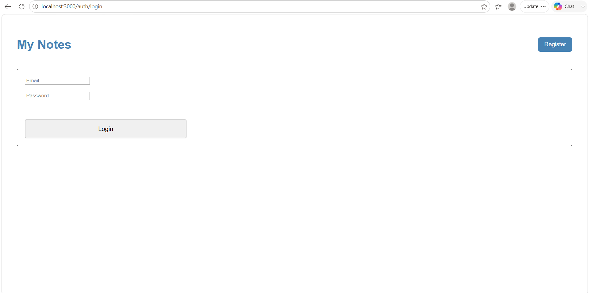
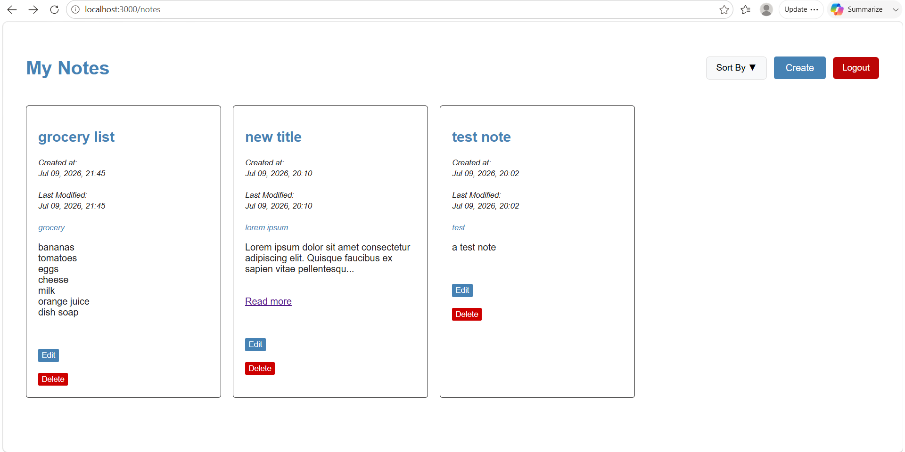
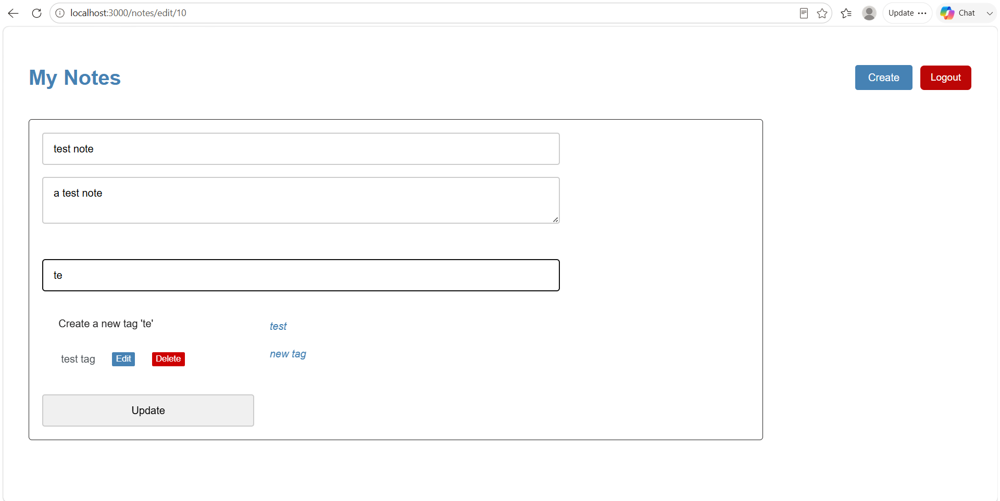

# Notes App

A simple notes web application built for learning backend development using NestJS, Prisma and PostgreSQL.
Users can register, log in, and manage their own notes and tags. Authentication is implemented manually using JWTs without Passport.
The project implements JWT authentication without Passport, allowing users to register, log in, and manage their own notes and tags.

---

## Features
- User registration
- User login
- JWT authentication
- HttpOnly cookie authentication
- Protected routes using a custom JWT guard
- Authorization to ensure users can only access their own notes and tags
- CRUD operations for notes and tags


## Tech Stack
- NestJS
- Prisma
- PostgreSQL
- JWT Authentication (without Passport)
- bcrypt
- EJS

---

## Getting Started

### Clone the repository

```bash
git clone https://github.com/taran-95/notes-app.git
cd notes-app
```


### Install dependencies

```bash
npm install
```


### Configure environment variables

Rename `.env.example` to `.env` and update the database connection string and JWT secret.


### Run Prisma migrations

```bash
npx prisma migrate dev
```


### Start the application

```bash
npm run start:dev
```


---

## Authentication

Authentication was implemented manually without using Passport.

- Passwords are hashed using bcrypt.
- JWTs are signed using NestJS's JwtService.
- Tokens are stored in HttpOnly cookies.
- Protected routes are secured using a custom JwtAuthGuard.


---

## Database

Main entities:
- User
- Note
- Tag
- Note_Tag (many-to-many relationship)

## Screenshots

### Login


### Notes


### Edit Note



---

## What I Learned

This project helped me understand:

- NestJS architecture
- Prisma ORM
- PostgreSQL relationships
- JWT authentication
- Cookie-based authentication
- Authentication vs. authorization
- Route protection using custom NestJS guards

